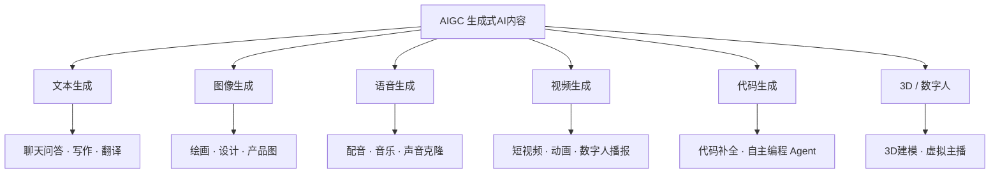
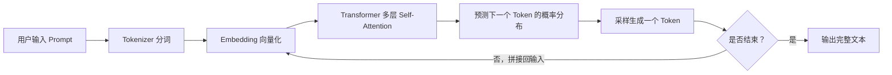
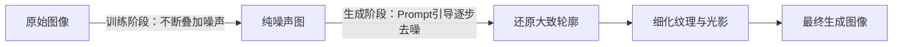
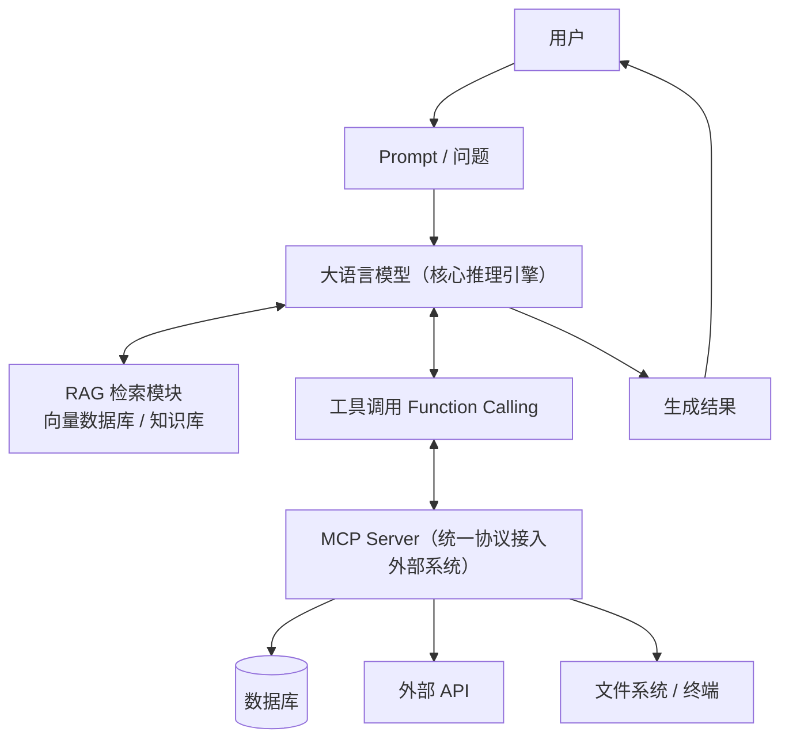
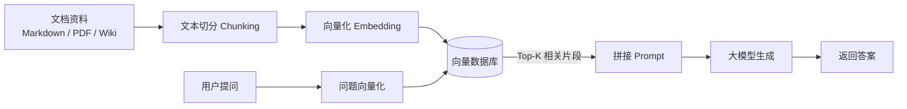
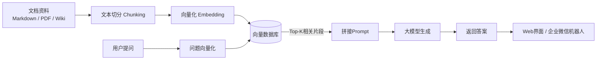

# AIGC 入门教程：从原理到实战（2026 年中版）44

> **写在前面**：这不是一份概念科普合集，而是按"看懂原理 → 认清全景 → 会写代码 → 能落地项目"这条线走的实操手册。适合有 Python 基础、想系统入门 AIGC 的同学。读完你应该能做到：看懂当下的 AIGC 全景、自己写代码调用大模型、搭一个最小可用的 RAG 问答系统、理解 Agent 和 MCP 到底是怎么回事。
>
> 声明：AIGC 领域几个月一变，文中涉及的具体模型版本号、价格以成文时（2026 年 7 月）的公开信息为准，使用前建议自行核实官网最新情况。

## 目录

1. AIGC 到底是什么
2. 技术内核：AIGC 是怎么"生成"内容的
3. 2026 年中的 AIGC 全景地图
4. 动手实践：用 Python 调用大模型（从 Hello World 到 RAG）
5. 进阶：Agent、Function Calling 与 MCP
6. IT 学生能落地的应用场景
7. 实战项目：搭一个运维/知识库问答机器人
8. 安全、合规与伦理红线
9. 常见坑与避坑指南
10. 进阶学习路线图
11. 参考资源

---

## 一、AIGC 到底是什么

AIGC（AI Generated Content，人工智能生成内容）指的是**用 AI 模型自动生成文本、图像、音频、视频、代码等内容**的技术和产品统称。它和传统 AI（比如人脸识别、推荐算法）的本质区别在于：传统 AI 大多是"判别式"的——给一张图判断是不是猫；AIGC 是"生成式"的——凭空造一张猫的图出来。

按内容形态，AIGC 大致分六类：



对 IT 从业者来说，最值得关注的是 **F（代码生成）** 和贯穿所有分支的 **Agent 化趋势**——2026 年的关键词已经从"能聊天"变成"能干活"：模型不再只是回答问题，而是能自己调用工具、操作系统、跑代码、查数据库，完成一整个任务链条。这也是本教程的重点方向。

---

## 二、技术内核：AIGC 是怎么"生成"内容的

不需要精通数学，但作为 IT 从业者，理解底层机制能让你用好这些工具、也能判断它们的能力边界在哪。

### 2.1 文本生成的核心：Transformer 与自回归

大语言模型（LLM）本质上做的是一件事：**根据前面的文字，预测下一个最可能出现的词，一个一个往后接龙**。



几个关键概念，用大白话解释：

- **Token（词元）**：模型看到的最小单位，不是字也不是词，是介于两者之间的"子词片段"。中文一个字大概率是 1～2 个 token，英文一个单词大概是 0.75 个 token。这直接决定你的 API 账单和上下文长度限制。
- **Embedding（向量化）**：把每个 token 变成一串数字（向量），语义相近的词在向量空间里距离也相近。"国王"和"女王"的向量差，跟"男人"和"女人"的向量差是接近的——这就是为什么模型能"理解"语义关系。
- **Self-Attention（自注意力）**：让模型在生成每个词时，能"回头看"前面所有词，并动态判断哪些词更重要。比如"他把苹果放进篮子，然后**它**破了"，模型要靠注意力机制判断"它"指的是苹果还是篮子。
- **自回归生成**：一次只吐一个 token，把新 token 拼回输入里再生成下一个——这就是为什么大模型的输出是"挤牙膏"一样一个字一个字蹦出来的，也是为什么长文本生成慢、贵。

### 2.2 图像 / 视频生成的核心：扩散模型

主流图像生成（Midjourney、Stable Diffusion、Flux、可灵、即梦背后的技术）靠的不是 Transformer 接龙，而是**扩散模型（Diffusion Model）**：



训练时，模型学习"给一张清晰图片一步步加噪声，最后变成雪花噪点"的过程；生成时反过来，模型从一张纯噪声图出发，在文字 Prompt 的引导下，一步步"猜"噪声该往哪个方向去除，最终从噪声里"雕刻"出一张符合描述的图。视频生成本质上是在此基础上加了时间维度和帧间一致性约束，计算量呈数量级上升——这也是为什么视频生成普遍比图像生成慢得多、贵得多。

### 2.3 多模态：让模型"既能看又能说"

2026 年的主流大模型基本都是多模态的：同一个模型既能处理文字，也能"看懂"图片、听懂语音、理解视频帧。实现思路通常是把不同模态的内容都编码成同一个向量空间里的表示，再交给同一套 Transformer 主干处理——这也是为什么现在你可以直接把一张报错截图丢给 AI，它能读懂并帮你分析问题。

### 2.4 现代 AI 系统架构：不只是模型，还有"外挂"

单纯一个大模型，知识是训练截止时间冻结的、也不知道你私有系统里的数据、更不能替你执行操作。真正好用的 AIGC 应用，是"大模型 + 外部能力"的组合：



这张图基本就是本教程第四、五节要动手实现的东西：**RAG** 解决"模型不知道你的私有数据"的问题，**工具调用 / Agent / MCP** 解决"模型不能替你干活"的问题。

---

## 三、2026 年中的 AIGC 全景地图

工具太多，选型是新手最容易卡住的地方。下面按类别给出目前主流选择和各自的定位，帮你少走弯路。

### 3.1 文本大模型

| 阵营 | 代表产品 | 核心优势 | 适合场景 |
|---|---|---|---|
| 国际闭源 | Claude 系列（Anthropic） | 编程与 Agent 能力突出，长文本写作稳定、逻辑严谨 | 专业开发、复杂代码重构、Agent 化工作流 |
| 国际闭源 | GPT 系列（OpenAI） | 用户基数最大，生态最全（图像、语音、Agent 自动化一体） | 日常通用、多模态一体化需求 |
| 国际闭源 | Gemini 系列（Google） | 超长上下文、多模态理解强，与 Android / Workspace 深度整合 | 长文档 / 长视频分析、谷歌生态用户 |
| 国产第一梯队 | DeepSeek | 开源、性价比极高，代码与推理能力在国产阵营里领先 | 私有化部署、预算有限的开发者 |
| 国产第一梯队 | 通义千问 Qwen（阿里） | 开源生态最完善，长文本与多语言支持好，工具调用稳定 | 企业级 Agent 开发、私有化部署 |
| 国产第一梯队 | 豆包 Doubao（字节） | C 端用户量大，创意写作 / 短视频脚本能力强，中文口语化表达自然 | 内容创作、日常问答 |
| 国产第一梯队 | Kimi（月之暗面） | 长文本 / 长文档处理是招牌能力 | 论文、合同、大部头资料分析 |
| 国产第一梯队 | 智谱 GLM | 逻辑推理与 Agent 能力突出 | 企业级应用、复杂任务编排 |
| 国产第一梯队 | 文心一言 ERNIE（百度） | 多模态理解稳健，办公场景集成好 | 文件识别、公文写作 |

> 💡 **接地气建议**：国际模型在国内日常访问经常不够顺畅，学习和练手阶段，优先用国产模型的开放平台——免费额度充足、访问稳定、中文效果也很能打，而且大多兼容 OpenAI 的 API 调用格式，代码几乎不用改，换个 `base_url` 就行。

### 3.2 图像生成工具

| 工具 | 定位 | 特点 |
|---|---|---|
| Midjourney | 艺术效果标杆 | 出图质感最"高级"，可控性相对弱，主要在网页/Discord操作 |
| Stable Diffusion | 开源自由度天花板 | 可本地部署（ComfyUI / WebUI），高度可控可微调，学习门槛较高 |
| Flux（Black Forest Labs） | 质量与易用性平衡 | 简单提示词也能出效果不错的图，新手友好 |
| 即梦 AI / 可灵 AI / 通义万相 | 国产主力 | 中文提示词理解好，无需科学上网，电商图、海报等场景很实用 |

### 3.3 视频生成工具

| 工具 | 定位 | 特点 |
|---|---|---|
| Sora（OpenAI） | 画质与物理真实感标杆 | 光影、材质、运动细节最接近真实拍摄，但生成慢、后期编辑能力弱 |
| Runway | 专业创作工具链 | 运动一致性好，编辑功能完整，专业视频团队用得多 |
| 可灵 Kling（快手） | 国产综合实力最强 | 中文提示词理解出色，无需额外网络环境，速度和成本友好 |
| Vidu / Google Veo 等 | 追赶者 | 各有细分优势，仍在快速迭代 |

### 3.4 AI 编程智能体（重点关注）

对 IT 学生来说，这是投入产出比最高的一类工具：

| 工具 | 形态 | 特点 |
|---|---|---|
| Claude Code | 命令行 Agent | 深度理解整个代码库，能自主运行测试、修复报错直到任务完成，token 使用效率高 |
| Cursor | AI 优先 IDE | Fork 自 VS Code，多模型路由，适合喜欢图形界面、边看边改的人 |
| GitHub Copilot | IDE 插件 + 云端 Agent | 与 GitHub 生态（Issue、PR、代码审查）深度绑定，企业采用率高 |
| Trae / 通义灵码等国产工具 | IDE / 插件 | 中文交互友好，内置国产模型，MCP 和插件市场上手快 |

> 这几款工具不是互相取代的关系，而是"主战场不同"：命令行重构用 Claude Code 类，IDE 内联编码用 Cursor / Copilot 类，团队协作看 GitHub 生态绑定程度。很多重度开发者是几个工具搭配着用。

### 3.5 核心趋势：从"对话"到"干活"

2026 年 AIGC 领域最大的范式转变，是 **Agentic AI（智能体化）**：模型不再只是等你提问再回答，而是能自主拆解任务、规划步骤、调用工具、检查结果、循环纠错，直到把一件事真正"干完"。支撑这个趋势的两个关键基础设施是：

- **MCP（Model Context Protocol，模型上下文协议）**：由 Anthropic 发起、现已成为行业事实标准的协议，用来标准化"大模型如何连接外部工具和数据源"——你可以把它理解成"AI 领域的 USB-C 接口"，在它之前，每接入一个新工具都要单独开发一套集成逻辑（M 个模型 × N 个工具 = M×N 份适配代码），MCP 把这个问题变成了 M+N。
- **A2A（Agent-to-Agent）协议**：解决"不同智能体之间怎么互相协作、互相认证"的问题，让你的编程 Agent 未来可以直接和企业内部的运维 Agent 安全对话。

第五节会用代码带你把 MCP 和工具调用的概念落地。

---

## 四、动手实践：用 Python 调用大模型（从 Hello World 到 RAG）

### 4.1 环境准备

```bash
python -m venv aigc-env
source aigc-env/bin/activate      # Windows 用 aigc-env\Scripts\activate
pip install openai numpy sentence-transformers
```

大部分国产大模型平台（DeepSeek、智谱、月之暗面等）都提供 **OpenAI 兼容接口**，这意味着你只需要装 `openai` 这一个 SDK，换个 `base_url` 就能无缝切换服务商，不用为每家平台单独学一套 API。

### 4.2 第一个 AIGC 程序：调用文本生成 API

```python
from openai import OpenAI

client = OpenAI(
    api_key="你的API_KEY",        # 建议用环境变量存储，不要硬编码进代码
    base_url="https://api.deepseek.com/v1"   # 换成你使用的服务商地址即可切换模型
)

response = client.chat.completions.create(
    model="deepseek-chat",
    messages=[
        {"role": "system", "content": "你是一名资深Linux运维专家，回答简洁，尽量给出可直接执行的命令。"},
        {"role": "user", "content": "如何查看当前磁盘IO占用最高的进程？"}
    ],
    temperature=0.3   # 数值越低越严谨保守，越高越发散有创意
)

print(response.choices[0].message.content)
```

`system` 角色定义模型的人设和行为边界，`user` 是用户输入，`temperature` 控制输出的随机性——写代码、查资料这类需要严谨性的任务用低温度（0～0.3），创意写作用高温度（0.7～1）。

### 4.3 Prompt Engineering 实战技巧

提示词工程不是玄学咒语，是有章可循的工程活。一个靠谱的 Prompt 通常包含五要素：**角色 + 背景 + 任务 + 输出格式 + 示例**。

对比看效果差异：

```text
❌ 模糊的Prompt：
"帮我写个函数处理一下这个数据"

✅ 结构化的Prompt：
你是一名Python后端工程师。
【背景】我们有一个用户行为日志列表，每条是字典 {"user_id": str, "action": str, "ts": int}
【任务】写一个函数，统计每个user_id出现的次数，按次数降序返回前10名
【要求】
1. 使用 collections.Counter 实现，不要用嵌套循环
2. 加类型注解和docstring
3. 附一个简单的单元测试
【输出格式】只输出代码，不要额外解释
```

结构化 Prompt 能显著减少"模型自由发挥"导致的返工。其他几个实用技巧：

- **给例子（Few-shot）**：与其口头描述格式要求，不如直接给 1～2 个输入输出的例子，模型模仿能力比理解抽象描述强得多。
- **让模型先想后答（Chain of Thought）**：对复杂推理任务，加一句"请先列出解题步骤，再给出最终答案"，正确率会明显提升。
- **拆解大任务**：不要指望一个 Prompt 让模型把整个系统设计完，把"设计数据库表结构""写API接口""写测试"拆成多轮对话，每轮聚焦一件事。
- **明确否定式约束**：比起"写得简洁点"，"不超过200字，不要用列表，不要说套话"这种可执行的负面约束效果更稳定。

### 4.4 进阶：给模型接上"外部知识"——RAG 最小实现

大模型的知识是训练时冻结的，也不知道你公司内部的文档。**RAG（Retrieval-Augmented Generation，检索增强生成）** 的思路很朴素：先把用户问题拿去"知识库"里检索相关片段，再把这些片段连同问题一起丢给大模型，让它"照着资料回答"，而不是凭记忆瞎编。



下面是一个不依赖付费向量数据库、纯本地跑起来的最小实现（生产环境建议换成 Milvus / Chroma / Qdrant 等专业向量数据库）：

```python
import numpy as np
from sentence_transformers import SentenceTransformer

# 1. 准备"知识库"：实际项目中这一步是把文档切分成小段落
docs = [
    "Nginx默认配置文件位于 /etc/nginx/nginx.conf",
    "重启Nginx服务的命令是 systemctl restart nginx",
    "查看Nginx错误日志的命令：tail -f /var/log/nginx/error.log",
    "Nginx负载均衡配置需要在http块中定义upstream",
]

# 2. 用本地开源模型把每段文字转成向量，完全离线，无需API Key
embedder = SentenceTransformer("shibing624/text2vec-base-chinese")
doc_vectors = embedder.encode(docs)

def retrieve(query: str, top_k: int = 2) -> list[str]:
    """用余弦相似度找出与问题最相关的文档片段"""
    query_vector = embedder.encode([query])[0]
    scores = np.dot(doc_vectors, query_vector) / (
        np.linalg.norm(doc_vectors, axis=1) * np.linalg.norm(query_vector)
    )
    top_indices = np.argsort(scores)[::-1][:top_k]
    return [docs[i] for i in top_indices]

# 3. 检索 + 拼接Prompt + 交给大模型生成最终答案
query = "nginx日志在哪里看"
context = "\n".join(retrieve(query))

prompt = f"""请严格根据下面的资料回答问题，资料中没有的信息，直接回答"资料中未提及"，不要编造。

【资料】
{context}

【问题】
{query}
"""

response = client.chat.completions.create(
    model="deepseek-chat",
    messages=[{"role": "user", "content": prompt}]
)
print(response.choices[0].message.content)
```

这就是绝大多数企业知识库问答机器人的核心逻辑，第七节的实战项目会在这个基础上扩展成一个可用的系统。

---

## 五、进阶：Agent、Function Calling 与 MCP

### 5.1 Function Calling：让模型学会"提需求"而不是"瞎编答案"

模型本身不能真正执行代码、查数据库。Function Calling 的机制是：你提前告诉模型"有哪些工具可以用、每个工具需要什么参数"，模型判断需要用工具时，**不会直接回答**，而是返回一个"我要调用哪个函数、参数是什么"的结构化请求，由你的代码去真正执行，再把结果喂回模型。

```python
tools = [
    {
        "type": "function",
        "function": {
            "name": "get_disk_usage",
            "description": "查询指定服务器的磁盘使用情况",
            "parameters": {
                "type": "object",
                "properties": {
                    "host": {"type": "string", "description": "服务器主机名或IP"}
                },
                "required": ["host"]
            }
        }
    }
]

response = client.chat.completions.create(
    model="deepseek-chat",
    messages=[{"role": "user", "content": "帮我看看web-01这台机器磁盘还剩多少空间"}],
    tools=tools
)

# 模型判断需要调用工具时，会在message里返回tool_calls，而不是直接给出文字答案
tool_call = response.choices[0].message.tool_calls[0]
print(tool_call.function.name)       # get_disk_usage
print(tool_call.function.arguments)  # {"host": "web-01"}

# 真正执行工具逻辑的是你自己的代码，比如通过SSH或监控API查询
def get_disk_usage(host: str) -> str:
    return "已用68%，剩余32GB"

# 把执行结果作为一条 role="tool" 的消息传回去，模型会基于结果组织出自然语言回复
```

### 5.2 MCP：别再为每个工具单独写一套接入代码

Function Calling 解决了"模型怎么表达需求"，但每接一个新系统（数据库、Slack、GitHub、内部运维平台……）都要单独写一套集成代码，工具一多就是灾难。**MCP（Model Context Protocol）** 把这件事标准化了：你只需要按 MCP 规范写一个 "Server"，任何支持 MCP 的客户端（Claude Code、Cursor、各种 Agent 框架）都能直接接入，不用重复造轮子。

一个 MCP Server 的接入配置大概长这样：

```json
{
  "mcpServers": {
    "linux-ops": {
      "command": "python",
      "args": ["./mcp_servers/linux_ops_server.py"],
      "env": {
        "SSH_KEY_PATH": "/home/user/.ssh/id_rsa"
      }
    }
  }
}
```

MCP 底层基于 JSON-RPC，支持 stdio（本地进程通信）、SSE、Streamable HTTP 三种传输方式。理解它不需要马上自己写 Server，但作为 IT 从业者，至少要知道：**现在几乎所有主流 Agent 工具的"外部集成"都在往 MCP 这个标准上收敛**，这决定了你未来接入自研系统时该往哪个方向设计接口。

---

## 六、IT 学生能落地的应用场景

结合前面的技术栈，几个投入产出比高、适合练手也适合写进简历的方向：

- **代码生成与 Code Review 辅助**：用 Claude Code / Cursor 类工具做日常开发，重点练"怎么写清楚需求让 Agent 一次做对"，这本身就是新时代的核心工程能力。
- **自动化文档 / 注释生成**：把生成式 AI 接入 CI 流程，代码提交时自动生成/更新函数注释、README、变更日志。
- **单元测试用例生成**：给模型看函数签名和逻辑，让它补全边界条件的测试用例，尤其适合练手"如何写好 Prompt 覆盖测试场景"。
- **运维 / 业务知识库问答机器人**：用 RAG 把内部 Wiki、SOP 文档、故障处理手册变成一个能直接问答的机器人，是本教程第七节的实战方向。
- **图像 / 视频素材生成**：产品原型图、海报、宣传短视频，用即梦 / 可灵这类国产工具，不需要专业设计和拍摄团队就能出素材。

---

## 七、实战项目：搭一个运维 / 知识库问答机器人

这是一个可以直接当课程作业或毕业设计方向的完整小项目，技术栈完全基于前面讲过的内容。



**技术选型建议**：

| 环节 | 推荐方案 | 说明 |
|---|---|---|
| 后端框架 | FastAPI | 轻量、异步支持好，符合IT学生已有的Python基础 |
| 向量数据库 | Chroma（练手）→ Milvus（生产） | Chroma零配置本地跑起来最快，Milvus适合后续接云原生部署练习 |
| Embedding模型 | text2vec-base-chinese / bge-small-zh | 中文效果好、可本地部署，不依赖API额度 |
| 大模型 | DeepSeek / 通义千问开放平台 | 免费额度足够支撑课程项目全程调试 |
| 部署 | Docker + Linux云主机 | 正好和已有的Linux、云运维课程内容打通 |

**建议实现步骤**：

1. **数据准备**：收集 20～50 篇内部文档（可以是运维SOP、课程讲义、常见问题FAQ），统一转成纯文本
2. **切分策略**：按段落或固定长度（比如300～500字）切块，块之间保留一定重叠（overlap），避免语义被切断
3. **向量化入库**：批量调用 Embedding 模型，写入向量数据库
4. **检索接口**：实现 `retrieve(query, top_k)`，返回最相关的文本片段
5. **生成接口**：拼接 Prompt，调用大模型 API，返回带来源引用的答案
6. **效果评估**：准备20个测试问题和标准答案，人工评分"回答是否准确"“是否有幻觉”，这一步很多新手会跳过，但恰恰是判断项目是否真正可用的关键
7. **加一层保护**：对用户输入做基本的长度限制和敏感词过滤，避免恶意 Prompt 注入

---

## 八、安全、合规与伦理红线

AIGC 好用，但落地时必须清楚几条红线，尤其是要交付给别人用的系统：

- **数据安全**：不要把客户数据、内部机密文档直接喂给公有云大模型 API，除非该服务商明确承诺不用于训练且符合公司数据合规要求；企业级场景优先考虑私有化部署的开源模型（DeepSeek、Qwen 等都提供可私有化的开源版本）。
- **内容合规**：根据《生成式人工智能服务管理暂行办法》，面向公众提供的生成式AI服务需要完成算法备案；根据《人工智能生成合成内容标识办法》，AI生成的内容需要做显式或隐式标识，产品设计阶段就要考虑进去。
- **版权风险**：训练数据的版权归属、生成内容能否商用，在国内外都还有持续演进的司法判例，商用前建议明确服务商的授权条款，不要想当然。
- **幻觉（Hallucination）**：模型会一本正经地编造不存在的事实、API、文献引用，越是专业、小众的领域越容易出问题。凡是涉及决策、发布、对外承诺的内容，必须人工复核。
- **Agent 权限管控**：给 Agent 接入 Function Calling / MCP 时，千万不要图省事给它无限制的 shell 执行权限或生产数据库写权限——这跟给实习生直接开 root 账号是一个道理，一定要做权限隔离、操作审计、危险操作二次确认。

---

## 九、常见坑与避坑指南

> 💡 以下是新手最容易踩的坑，都是实打实会浪费时间和金钱的教训。

- **迷信"神奇咒语"**：Prompt Engineering 是"写清楚需求"的工程活，不是背几句网上流传的万能话术，遇到效果不好，先反思需求描述是否清晰，而不是到处抄咒语。
- **无限重试导致账单爆炸**：写代码调 API 时一定要设置超时和重试上限，一个死循环 bug 可能一晚上刷掉几百块。
- **混淆"训练模型"和"使用模型"**：入门阶段99%的场景是在调用别人训练好的模型（API 或开源权重），不需要、也没必要自己从零训练大模型。
- **生成的代码不测试直接上线**：AI 写的代码可能语法正确但逻辑有隐藏 bug，尤其是边界条件和并发场景，测试环节不能省。
- **上下文塞得越多越好**：把整个文档甩给模型不一定比精准检索几个相关片段效果好，无关信息反而会干扰模型注意力、拉高成本。
- **只用一个模型打天下**：不同模型各有长短，代码任务、创意写作、长文档分析未必要用同一个模型，多留几个备选账号，遇到效果不理想及时切换。

---

## 十、进阶学习路线图

给自己定一个四阶段节奏，每个阶段都以能产出一个小成果为目标：

| 阶段 | 目标 | 产出 |
|---|---|---|
| 第一阶段：基础 | 掌握 Prompt Engineering、API调用、Token与成本概念 | 用 Python 写一个命令行小工具（比如自动生成commit message） |
| 第二阶段：检索增强 | 掌握 Embedding、向量检索、RAG架构 | 搭一个基于本地文档的最小RAG问答demo |
| 第三阶段：智能体化 | 掌握 Function Calling、Agent设计、MCP协议 | 给RAG系统加上工具调用能力（比如能查实时数据） |
| 第四阶段：项目落地 | 完整系统的部署、评估、安全加固 | 部署一个能实际使用的知识库/运维问答机器人，写清楚测试报告 |

---

## 十一、参考资源

- Anthropic 官方文档（Claude API、Claude Code、MCP协议）：`docs.anthropic.com`
- OpenAI 官方文档：`platform.openai.com/docs`
- Model Context Protocol 官方规范：`modelcontextprotocol.io`
- Hugging Face（开源模型与数据集）：`huggingface.co`
- LangChain 文档（RAG / Agent 框架）：`python.langchain.com`
- 国内各大模型开放平台：DeepSeek、通义千问（阿里云百炼）、智谱AI、月之暗面 Kimi，搜索"厂商名 + 开放平台"即可找到官方入口，注册后都有免费调试额度

---

> 写在最后：AIGC 这行最大的特点是"上手门槛低，做深门槛高"。跑通一个 Hello World 只需要十分钟，但把一个系统做到真正稳定、安全、好用，考验的还是扎实的工程能力——这也是为什么这份教程把大半篇幅放在"动手实践"和"项目落地"上，而不是停留在概念介绍。建议每看完一节就动手跑一遍代码，比看十遍原理讲解都管用。

