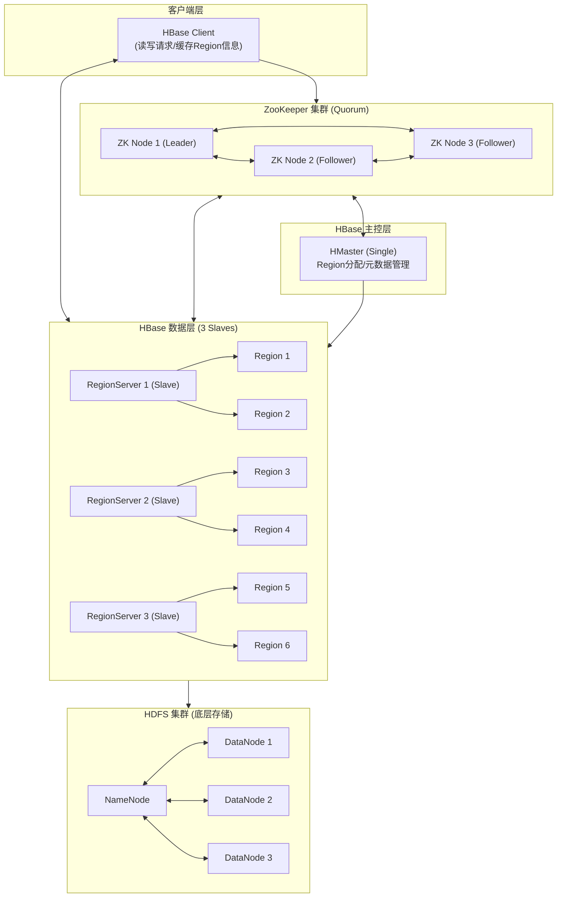

# HBase + ZooKeeper 集群安装教程

在完成 Hadoop 集群的搭建后，引入 **HBase** 和 **ZooKeeper** 是实现海量数据实时随机读写的核心环节。在你的 **1 Master + 3 Slaves** 架构中，这两个组件的协作形成了大数据平台的“神经系统”与“存储核心”。



------

你可以把 ZooKeeper 看作是整个集群的“指挥中心”。HMaster（指挥官）和 RegionServer（工人）都必须向它汇报状态。Client（用户）想要读写数据，第一站永远是 ZooKeeper，因为它保存了指向数据的“地图”（即 `hbase:meta` 表的位置）。

---

### 1. 核心角色与职责

如果把整个集群比作一个大型物流仓库，那么：

* **HBase (仓库系统)**：它是基于 **HDFS**（底层硬盘）构建的 NoSQL 数据库。它能让你在 PB 级的数据中，像在 Excel 里查单元格一样，实现**毫秒级**的随机读写。
* **ZooKeeper (调度员)**：它不存储你的业务数据，但它知道“谁在哪”。它负责监控所有服务器的健康状况，并保存集群的核心元数据。

---

### 2. 为什么 HBase 离不开 ZooKeeper？

没有 ZooKeeper，HBase 就会陷入混乱。它的专业作用体现在：

1. **高可用（HA）保障**：如果 HMaster（指挥官）挂了，ZooKeeper 会立即在备选服务器中选出新的指挥官。
2. **存活监控**：它通过“心跳”机制监控每一个 RegionServer（工人）。一旦工人失联，它会立刻通知指挥官把活儿分给别人。
3. **寻址导航**：客户端（Client）想要读写数据，第一站永远是 ZooKeeper，因为它保存了 `hbase:meta`（数据地图）所在的位置。

---

### 3. 集群架构规划 (1 Master + 3 Slaves)

在典型的 4 节点架构中，为了满足 **ZooKeeper 的“过半数存活”原则**，部署建议如下：

| 节点       | ZooKeeper | HBase 角色    | 部署逻辑                |
| ---------- | --------- | ------------- | ----------------------- |
| **master** | ✅ (ZK-1)  | **HMaster**   | 核心控制台 + 仲裁节点 1 |
| **slave1** | ✅ (ZK-2)  | HRegionServer | 数据节点 + 仲裁节点 2   |
| **slave2** | ✅ (ZK-3)  | HRegionServer | 数据节点 + 仲裁节点 3   |
| **slave3** | ❌         | HRegionServer | 纯数据节点              |

**💡 专业解释：为什么 ZK 是 3 个而不是 4 个？**
ZooKeeper 选举需要满足公式 。4 个节点和 3 个节点的容错能力是一样的（都只允许挂 1 个），但 3 个节点通信开销更小，性价比最高。

---

### 4. 数据寻址流程 (HBase 2.x 版本)

当你想从 HBase 读取一行数据时，内部发生了什么？

1. **问路**：客户端访问 ZooKeeper，询问：`hbase:meta`（元数据表）在哪台机器上？
2. **看图**：客户端连接对应的 RegionServer，读取 `hbase:meta` 表，确定你的 RowKey 所在的具体 Region。
3. **取货**：客户端直接前往目标 RegionServer 读取数据。
* *注意：此时已经不需要 HMaster 参与了，这种设计极大减轻了主节点的压力。*

---

### 5. 安装部署的“三大军规”

在实际操作中，以下三点直接决定了集群的稳定性：

* **军规一：时钟同步 (NTP)**
HBase 对时间极其敏感。如果节点间误差超过 **30 秒**，RegionServer 会因为“超时”而自动关闭（自杀）。
* **军规二：禁用内置 ZK**
在 `hbase-env.sh` 中设置 `export HBASE_MANAGES_ZK=false`。让 ZK 独立运行，这样即使 HBase 重启，ZK 的状态也不会丢失。
* **军规三：HDFS 预热**
启动 HBase 前，必须确保 Hadoop 已经退出了**安全模式**（Safe Mode），否则 HBase 无法在 HDFS 上创建初始化目录。

---

.jpg)

HBase 负责存储和处理海量数据，而 ZooKeeper 则在背后默默协调一切。

------

# 🛑 环境检查

在安装前，请确保 **所有节点** 满足以下条件：

1. **防火墙已关**：`systemctl stop firewalld`。
2. **时间已同步**：所有节点时间误差需 < 30s。
3. **Hadoop 已启动**：且 `hdfs dfsadmin -report` 显示有 3 个 Live DataNodes。
4. **清理旧残留**：如果之前启动失败过，请先在所有节点执行： `rm -rf /usr/local/zookeeper/data/*`（清空 ZK 数据目录）。

# 上传安装包

**用Xshell的Xftp上传到Master**

打开Xftp，连接master，把两个文件上传到 `/opt/`：

```bash
# 先创建目录
mkdir -p /opt
```

上传：

- `hbase-2.5.7-bin.tar.gz`
- `apache-zookeeper-3.8.3-bin.tar.gz`


------

既然你的 Hadoop 3.x 集群（1 Master + 3 Slaves）已经跑通，接下来的 **Zookeeper** 和 **HBase** 安装将完成大数据平台的“核心三角”构建。

由于 HBase 强依赖 Zookeeper 来实现高可用和元数据管理，我们**必须先安装 Zookeeper，再安装 HBase**。

# 第一阶段：安装ZooKeeper（master上操作）

## 1. 解压

```bash
cd /opt
tar -zxvf apache-zookeeper-3.8.3-bin.tar.gz -C /usr/local/
mv /usr/local/apache-zookeeper-3.8.3-bin /usr/local/zookeeper
```

## 2. 配置环境变量

```bash
vim /etc/profile
```

末尾添加：

```bash
export JAVA_HOME=/usr/java/jdk1.8.0_281-amd64
export ZOOKEEPER_HOME=/usr/local/zookeeper
export PATH=$PATH:$JAVA_HOME/bin:$ZOOKEEPER_HOME/bin
```

```bash
source /etc/profile

# 验证
java -version
zkServer.sh version
```


## 3. 创建数据目录

```bash
mkdir -p /usr/local/zookeeper/data
mkdir -p /usr/local/zookeeper/logs
```

## 4. 配置zoo.cfg

```bash
cd /usr/local/zookeeper/conf
cp zoo_sample.cfg zoo.cfg
vim zoo.cfg
```

替换成如下完整内容：

```bash
tickTime=2000
initLimit=10
syncLimit=5
dataDir=/usr/local/zookeeper/data
dataLogDir=/usr/local/zookeeper/logs
clientPort=2181
server.1=master:2888:3888
server.2=slave1:2888:3888
server.3=slave2:2888:3888
```


## 5. 设置master的myid

```bash
echo "1" > /usr/local/zookeeper/data/myid
cat /usr/local/zookeeper/data/myid  # 确认显示1
```


## 6. 分发到slave1和slave2

```bash
# 分发zookeeper
scp -r /usr/local/zookeeper root@slave1:/usr/local/
scp -r /usr/local/zookeeper root@slave2:/usr/local/

# 分发环境变量到所有节点
scp /etc/profile root@slave1:/etc/profile
scp /etc/profile root@slave2:/etc/profile
scp /etc/profile root@slave3:/etc/profile

# 各节点生效环境变量
ssh root@slave1 "source /etc/profile"
ssh root@slave2 "source /etc/profile"
ssh root@slave3 "source /etc/profile"
```

## 7. 设置slave1和slave2的myid

```bash
ssh root@slave1 "echo '2' > /usr/local/zookeeper/data/myid"
ssh root@slave2 "echo '3' > /usr/local/zookeeper/data/myid"

# 验证
ssh root@slave1 "cat /usr/local/zookeeper/data/myid"  # 显示2
ssh root@slave2 "cat /usr/local/zookeeper/data/myid"  # 显示3
```

## 8. 编写ZooKeeper管理脚本

```bash
vi /usr/local/zookeeper/zk.sh
```

```bash
#!/bin/bash
case $1 in
"start"){
  for i in master slave1 slave2
  do
    echo "========== 启动 $i ZooKeeper =========="
    ssh root@$i "source /etc/profile && zkServer.sh start"
  done
};;
"stop"){
  for i in master slave1 slave2
  do
    echo "========== 停止 $i ZooKeeper =========="
    ssh root@$i "source /etc/profile && zkServer.sh stop"
  done
};;
"status"){
  for i in master slave1 slave2
  do
    echo "========== $i ZooKeeper 状态 =========="
    ssh root@$i "source /etc/profile && zkServer.sh status"
  done
};;
esac
```

```bash
chmod +x /usr/local/zookeeper/zk.sh
```


## 9. 启动并验证ZooKeeper

```bash
/usr/local/zookeeper/zk.sh start

# 稍等几秒再查状态
sleep 3
/usr/local/zookeeper/zk.sh status
```

正常输出：

```
========== master ZooKeeper 状态 ==========
Mode: follower
========== slave1 ZooKeeper 状态 ==========
Mode: leader
========== slave2 ZooKeeper 状态 ==========
Mode: follower
```

> 1台leader + 2台follower 即成功 ✅


------

# 第二阶段：安装HBase（master上操作）

## 1. 解压

```bash
cd /opt
tar -zxvf hbase-2.5.7-bin.tar.gz -C /usr/local/
mv /usr/local/hbase-2.5.7 /usr/local/hbase
```

## 2. 配置环境变量

```bash
vim /etc/profile
```

在已有内容基础上追加：

```bash
export HBASE_HOME=/usr/local/hbase
export PATH=$PATH:$HBASE_HOME/bin
```

```
source /etc/profile
```

## 3. 配置hbase-env.sh

```bash
vim /usr/local/hbase/conf/hbase-env.sh
```

末尾添加：

```bash
export JAVA_HOME=/usr/java/jdk1.8.0_281-amd64
export HBASE_MANAGES_ZK=false
export HBASE_LOG_DIR=/usr/local/hbase/logs
```

## 4. 配置hbase-site.xml

```bash
vim /usr/local/hbase/conf/hbase-site.xml
```

```xml
<configuration>
  <property>
    <name>hbase.wal.provider</name>
    <value>filesystem</value>
  </property>
  <!-- 数据存储在HDFS路径 -->
  <property>
    <name>hbase.rootdir</name>
    <value>hdfs://master:8020/hbase</value>
  </property>

  <!-- 开启分布式模式 -->
  <property>
    <name>hbase.cluster.distributed</name>
    <value>true</value>
  </property>

  <!-- ZooKeeper节点 -->
  <property>
    <name>hbase.zookeeper.quorum</name>
    <value>master,slave1,slave2</value>
  </property>

  <!-- ZooKeeper端口 -->
  <property>
    <name>hbase.zookeeper.property.clientPort</name>
    <value>2181</value>
  </property>

  <!-- ZooKeeper数据目录 -->
  <property>
    <name>hbase.zookeeper.property.dataDir</name>
    <value>/usr/local/zookeeper/data</value>
  </property>

  <!-- HMaster端口 -->
  <property>
    <name>hbase.master.port</name>
    <value>16000</value>
  </property>

  <!-- HMaster Web UI端口 -->
  <property>
    <name>hbase.master.info.port</name>
    <value>16010</value>
  </property>
</configuration>
```

## 5. 配置regionservers

```bash
vim /usr/local/hbase/conf/regionservers
```

删除localhost，改为：

```
slave1
slave2
slave3
```

## 6. 软链接Hadoop配置文件

> 先确认你的Hadoop安装路径，执行 `ls /usr/local/` 或 `ls /opt/` 找到hadoop目录

```bash
# 假设hadoop在/usr/local/hadoop-3.3.6，根据实际路径调整
ln -s /usr/local/hadoop-3.3.6/etc/hadoop/core-site.xml /usr/local/hbase/conf/core-site.xml
ln -s /usr/local/hadoop-3.3.6/etc/hadoop/hdfs-site.xml /usr/local/hbase/conf/hdfs-site.xml
```

## 7. 处理jar包冲突

```bash
mv /usr/local/hbase/lib/client-facing-thirdparty/slf4j-reload4j-1.7.33.jar \
   /usr/local/hbase/lib/client-facing-thirdparty/slf4j-reload4j-1.7.33.jar.bak
```

## 8. 分发HBase到所有节点

```bash
scp -r /usr/local/hbase root@slave1:/usr/local/
scp -r /usr/local/hbase root@slave2:/usr/local/
scp -r /usr/local/hbase root@slave3:/usr/local/

# 分发最新环境变量
scp /etc/profile root@slave1:/etc/profile
scp /etc/profile root@slave2:/etc/profile
scp /etc/profile root@slave3:/etc/profile

# 各节点生效
ssh root@slave1 "source /etc/profile"
ssh root@slave2 "source /etc/profile"
ssh root@slave3 "source /etc/profile"
```

------

# 第三阶段：启动集群

## ⚠️ 严格按顺序启动

```
Hadoop → ZooKeeper → HBase
```

## 1. 确认Hadoop正常

```bash
jps
# 必须有 NameNode 和 ResourceManager
```

没启动则：

```bash
start-dfs.sh && start-yarn.sh
```


## 2. 启动ZooKeeper

```bash
/usr/local/zookeeper/zk.sh start
sleep 3
/usr/local/zookeeper/zk.sh status  # 确认leader/follower正常
```

## 3. 启动HBase

```bash
start-hbase.sh
```

------

# 第四阶段：验证集群

## 查看各节点进程

```bash
# master上
jps
# 应有：NameNode ResourceManager QuorumPeerMain HMaster

# slave节点
ssh root@slave1 jps
# 应有：DataNode NodeManager QuorumPeerMain HRegionServer

ssh root@slave3 jps
# 应有：DataNode NodeManager HRegionServer
```


## 查看HBase集群状态

```bash
# 先进入hbase shell
hbase shell

status
```

输出：

```
1 active master, 0 backup masters, 3 servers, 0 dead
```


## 一键启停脚本

### 1. 一键启动脚本：`cluster-start.sh`

这个脚本会先拉起集群各节点的 ZooKeeper，待选举完成后，再在 Master 启动 HBase。

```bash
#!/bin/bash

# --- 节点定义 ---
ZK_NODES=("master" "slave1" "slave2")
HBASE_NODES=("master" "slave1" "slave2" "slave3")

# --- 路径定义 ---
ZK_HOME="/usr/local/zookeeper"
HBASE_HOME="/usr/local/hbase"

echo "================ [1/3] 启动 ZooKeeper 集群 (3节点) ================"
for node in "${ZK_NODES[@]}"
do
    echo ">>> 正在启动 $node 的 ZK..."
    ssh $node "source /etc/profile; $ZK_HOME/bin/zkServer.sh start"
done

echo "等待 ZK 选举..."
sleep 5

echo "================ [2/3] 启动 HBase 集群 (全节点) ================"
# 启动前清理 ZK 残留防止 Master 抢占失败 (可选，若经常启动失败可开启)
# ssh master "source /etc/profile; $ZK_HOME/bin/zkCli.sh deleteall /hbase > /dev/null 2>&1"

source /etc/profile
$HBASE_HOME/bin/start-hbase.sh

echo "正在等待 HMaster 初始化..."
sleep 15

echo "================ [3/3] 检查集群 Java 进程 ================"
for node in "${HBASE_NODES[@]}"
do
    echo "--- $node 状态 ---"
    ssh $node "jps | grep -E 'QuorumPeerMain|HMaster|HRegionServer'"
done

echo "启动流程结束，请运行 'hbase shell' 进入测试。"
```

------

### 2. 一键停止脚本：`cluster-stop.sh`

停止顺序必须是 **先 HBase 后 ZooKeeper**，否则 HBase 会因为失去 ZK 协调而导致进程无法正常退出，最后只能通过 `kill -9` 硬杀，这容易损坏数据。

```bash
#!/bin/bash

# --- 节点定义 ---
ZK_NODES=("master" "slave1" "slave2")
HBASE_NODES=("master" "slave1" "slave2" "slave3")

# --- 路径定义 ---
ZK_HOME="/usr/local/zookeeper"
HBASE_HOME="/usr/local/hbase"

echo "================ [1/2] 停止 HBase 集群 ================"
source /etc/profile
$HBASE_HOME/bin/stop-hbase.sh

# 给 HBase 留出刷写 MemStore 到 HDFS 的时间
echo "等待 HBase 进程完全退出..."
sleep 10

echo "================ [2/2] 停止 ZooKeeper 集群 ================"
for node in "${ZK_NODES[@]}"
do
    echo ">>> 正在停止 $node 的 ZK..."
    ssh $node "source /etc/profile; $ZK_HOME/bin/zkServer.sh stop"
done

echo "================ 集群已全线停止 ================"
```

------

### 3. 部署与权限设置

1. **创建文件**：

   ```bash
   vi /usr/local/bin/cluster-start.sh
   vi /usr/local/bin/cluster-stop.sh
   ```

2. **赋予执行权限**：

   ```bash
   chmod +x /usr/local/bin/cluster-*.sh
   ```

### 🚀 集群救护脚本：`cluster-rescue.sh`

请在 `master` 节点创建该文件：`vi /usr/local/bin/cluster-rescue.sh`

```bash
#!/bin/bash

# --- 基础配置 ---
ZK_NODES=("master" "slave1" "slave2")
HBASE_NODES=("master" "slave1" "slave2" "slave3")
ZK_HOME="/usr/local/zookeeper"
HBASE_HOME="/usr/local/hbase"

echo "================ [1/5] 强制退出 HDFS 安全模式 ================"
source /etc/profile
hadoop dfsadmin -safemode leave

echo "================ [2/5] 强杀全集群 HBase/ZK 僵尸进程 ================"
for node in "${HBASE_NODES[@]}"
do
    echo ">>> 正在清理 $node 上的残留进程..."
    ssh $node "ps -ef | grep -E 'HMaster|HRegionServer|QuorumPeerMain' | grep -v grep | awk '{print \$2}' | xargs -r kill -9"
done
sleep 2

echo "================ [3/5] 清理 ZooKeeper 中的 HBase 脏数据 ================"
# 使用 Master 上的 ZK 客户端连接集群进行清理
$ZK_HOME/bin/zkCli.sh -server master:2181 <<EOF
deleteall /hbase
quit
EOF
echo "ZK 节点 /hbase 已重置。"

echo "================ [4/5] 重新启动集群 (ZK -> HBase) ================"
# 调用你之前的启动脚本
if [ -f /usr/local/bin/cluster-start.sh ]; then
    /usr/local/bin/cluster-start.sh
else
    echo "未找到 cluster-start.sh，请手动执行启动命令。"
    exit 1
fi

echo "================ [5/5] 救护完成！正在进入日志监控模式 ================"
echo "提示：看到 'Master has completed initialization' 后即可按 Ctrl+C 退出日志。"
sleep 3
tail -f $HBASE_HOME/logs/hbase-root-master-master.out
```

------

### 🛠️ 部署说明

1. **赋予执行权限**：

   ```bash
   chmod +x /usr/local/bin/cluster-rescue.sh
   ```

2. **使用场景**：

   - 当 `hbase shell` 报错 `NoNode for /hbase/master` 时。
   - 当 `jps` 看到进程在，但 `status` 显示 `0 servers` 时。
   - 当 `stop-hbase.sh` 卡死无法关闭集群时。

## 确认HDFS上创建了/hbase目录

```bash
hdfs dfs -ls /
# 应看到 /hbase 目录
```

## 浏览器访问Web UI

| 服务         | 地址                |
| ------------ | ------------------- |
| HBase Web UI | http://master:16010 |
| HDFS         | http://master:9870  |
| YARN         | http://master:8088  |


------

# 第五阶段：HBase测试

```bash
hbase shell
# 查看状态
status

# 创建表
create 'student', 'info', 'score'

# 查看表
list

# 插入数据
put 'student', '1001', 'info:name', 'zhangsan'
put 'student', '1001', 'info:age',  '18'
put 'student', '1001', 'score:math','95'
put 'student', '1002', 'info:name', 'lisi'
put 'student', '1002', 'score:math','88'

# 扫描全表
scan 'student'

# 查询单行
get 'student', '1001'

# 统计行数
count 'student'

# 退出
exit
```

------

# 日常管理

```bash
# 一键启动全部
start-dfs.sh && start-yarn.sh && /usr/local/zookeeper/zk.sh start && start-hbase.sh

# 一键停止全部（顺序相反）
stop-hbase.sh && /usr/local/zookeeper/zk.sh stop && stop-yarn.sh && stop-dfs.sh

# 查看HBase日志
tail -f /usr/local/hbase/logs/hbase-root-master-*.log

# 进入ZooKeeper客户端查看节点
zkCli.sh -server master:2181
ls /hbase
```

------

# 常见报错

| 报错                 | 原因                 | 解决                         |
| -------------------- | -------------------- | ---------------------------- |
| HMaster启动后退出    | ZooKeeper未启动      | 先确认ZK状态                 |
| 3 servers变成0       | RegionServer注册失败 | 检查hosts和防火墙            |
| HDFS连接失败         | 端口写错             | 确认用8020不是9000           |
| slf4j冲突            | jar包版本冲突        | 执行第7步备份                |
| 软链接失败           | Hadoop路径不对       | `ls /usr/local` 确认路径     |
| RegionServer无法注册 | hosts不一致          | 检查4台/etc/hosts            |
| ZK选不出leader       | myid配置错误         | 检查各节点myid               |
| /hbase目录权限问题   | HDFS权限不足         | `hdfs dfs -chmod 777 /hbase` |

------

.jpg)
